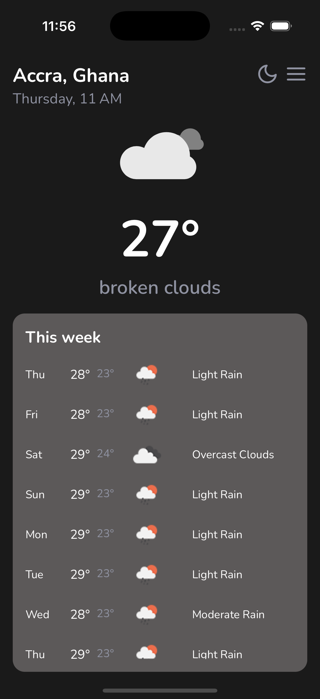
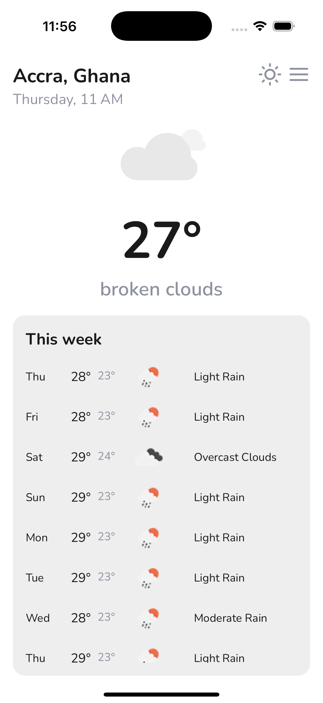

# Weather App

A beautiful, modern weather application built with React Native and Expo, featuring real-time weather data and an intuitive user interface.

## Screenshots

<div align="center">
  
### 🌙 Dark Theme


*Dark theme optimized for low-light viewing*

### ☀️ Light Theme  


*Light theme for bright environments*

</div>

## Features

- **Real-time Weather Data**: Current weather conditions and 7-day forecast
- **Theme Support**: Dark and light themes with system preference detection
- **Location-based**: Automatic location detection or manual location selection
- **Clean UI**: Modern, intuitive interface with smooth animations
- **Cross-platform**: Runs on both iOS and Android

## Tech Stack

- **React Native** with Expo
- **TypeScript** for type safety
- **Zustand** for state management with persistence
- **Shopify Restyle** for consistent theming
- **Bottom Sheet** for interactive UI components
- **React Native Reanimated** for smooth animations

## Installation

1. Clone the repository:
```bash
git clone https://github.com/aidooyaw1992/weather-app.git
cd weather-app
```

2. Install dependencies:
```bash
npm install
# or
yarn install
```

3. Start the development server:
```bash
npx expo start
```

4. Run on your device:
   - Scan the QR code with Expo Go app (Android/iOS)
   - Press `i` for iOS simulator
   - Press `a` for Android emulator

## Configuration

### Weather API
1. Get an API key from [OpenWeatherMap](https://openweathermap.org/api)
2. Create a `.env` file in the root directory:
```env
EXPO_PUBLIC_WEATHER_API_KEY=your_api_key_here
```

### Predefined Locations
The app includes several predefined locations:
- Accra, Ghana
- New York, United States
- London, United Kingdom
- Khartoum, Sudan

## Project Structure

```
src/
├── components/          # Reusable UI components
├── app/            # Screen components
├── store/              # Zustand store configuration
├── services/           # API and location services
├── theme/              # Theme configuration
└── types/              # TypeScript type definitions
```

## Key Components

- **CurrentWeatherIcon**: Dynamic weather icons based on conditions
- **WeatherListItem**: Daily forecast items
- **StyledRadioGroup**: Theme selection component
- **LocationService**: GPS and permission handling

## Development Notes

### AI Usage Disclosure
This project was developed with assistance from Claude AI, which helped with:
- Code architecture and best practices
- TypeScript type definitions
- State management patterns
- UI component design
- Error handling strategies

The AI provided guidance and code suggestions, but all final implementation decisions and code review were done by the developer.

## Contributing

1. Fork the repository
2. Create a feature branch: `git checkout -b feature-name`
3. Make your changes and commit: `git commit -m 'Add feature'`
4. Push to the branch: `git push origin feature-name`
5. Submit a pull request

## License

This project is licensed under the MIT License - see the [LICENSE](LICENSE) file for details.

## Acknowledgments

- Weather data provided by [OpenWeatherMap](https://openweathermap.org/)
- Icons from [Expo Vector Icons](https://docs.expo.dev/guides/icons/)
- UI components inspired by modern weather apps
- Built with assistance from Claude AI

---

Made with ❤️ and React Native